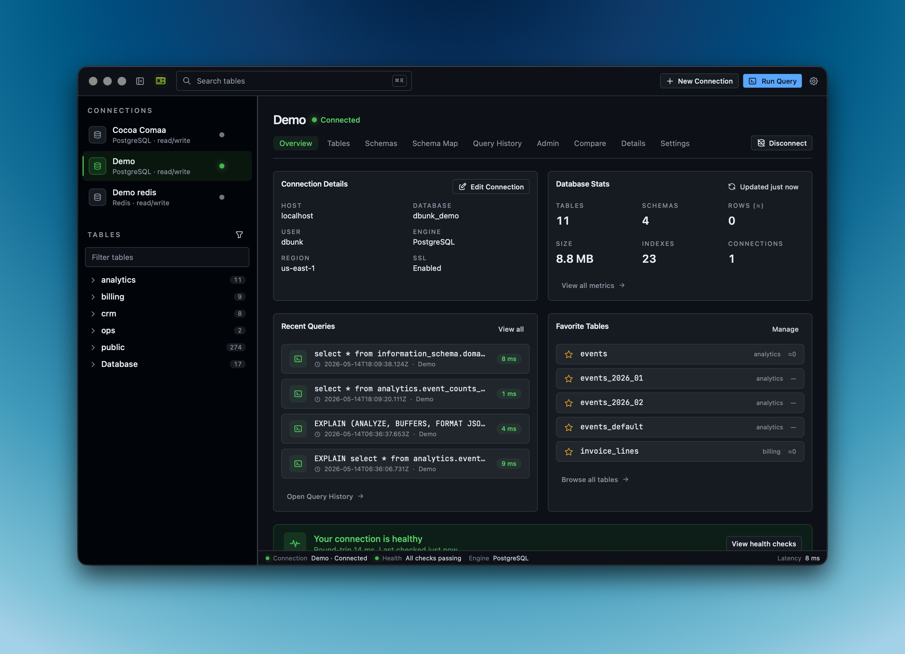
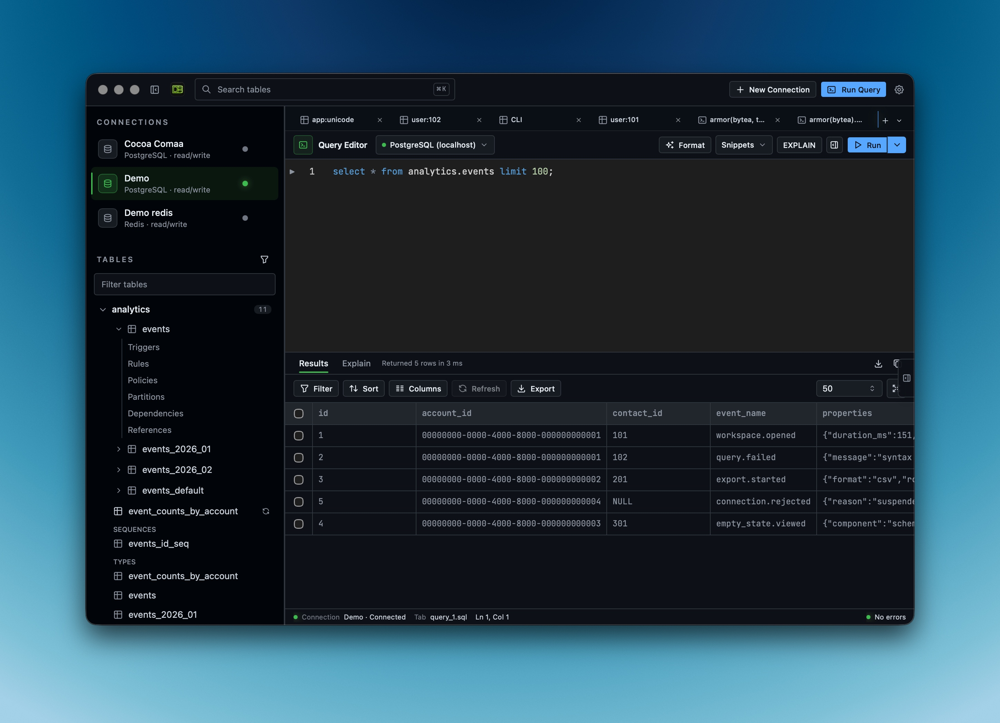
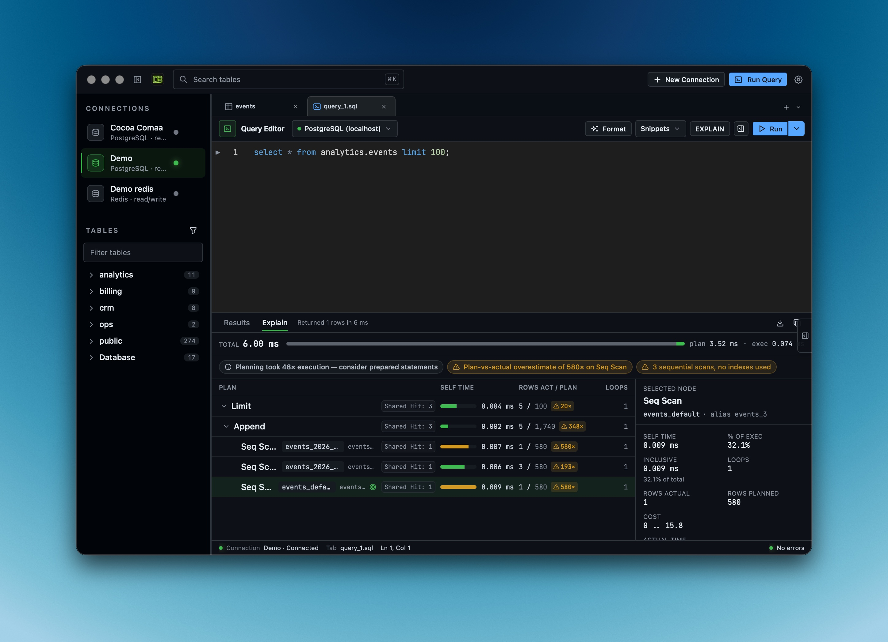
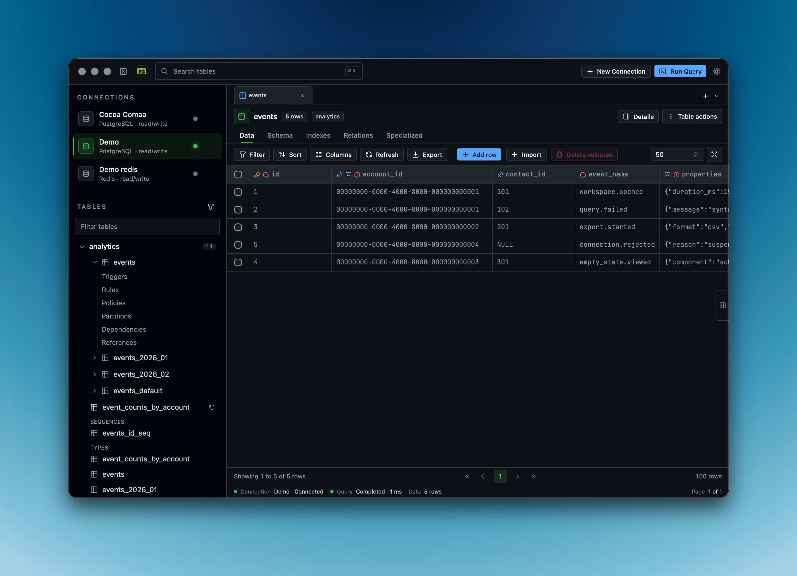
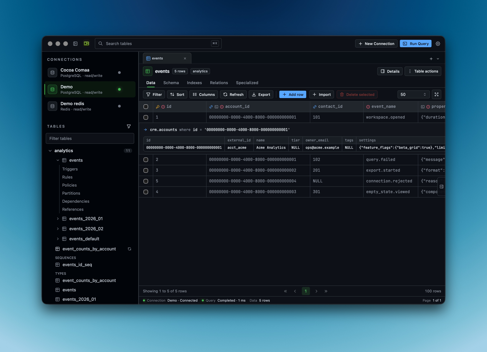
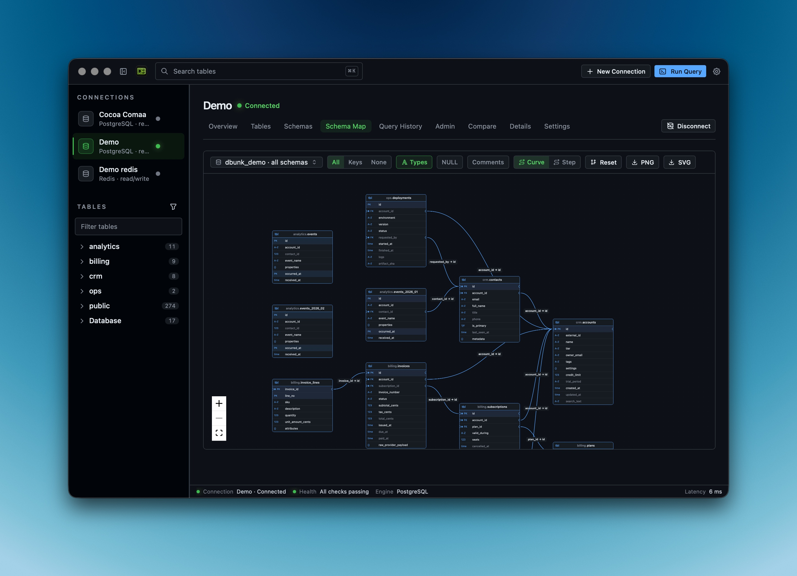
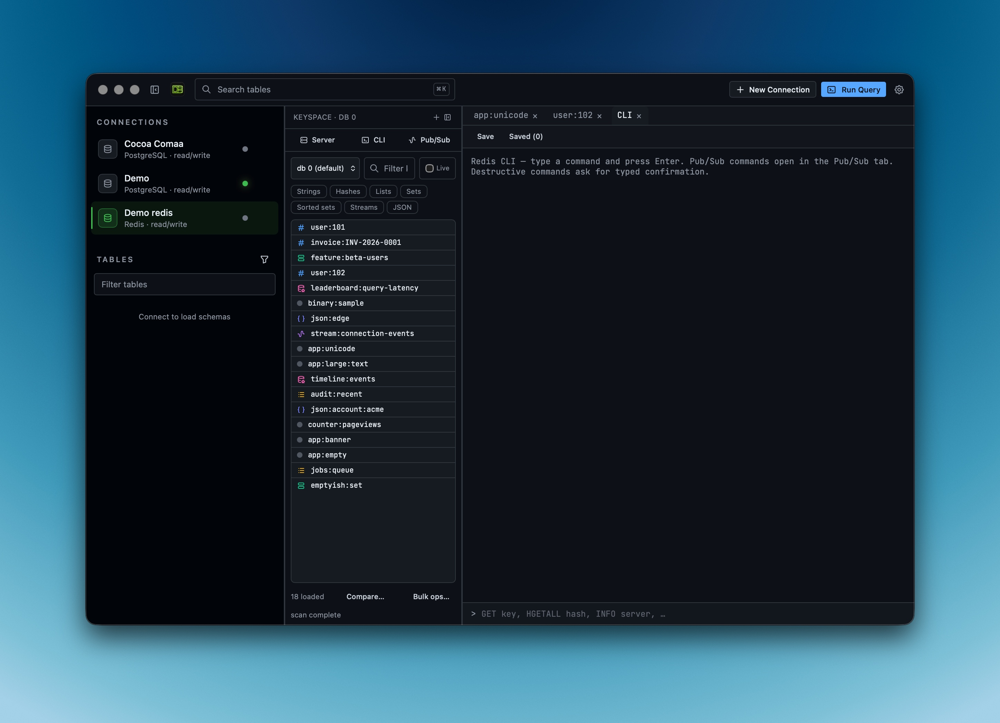
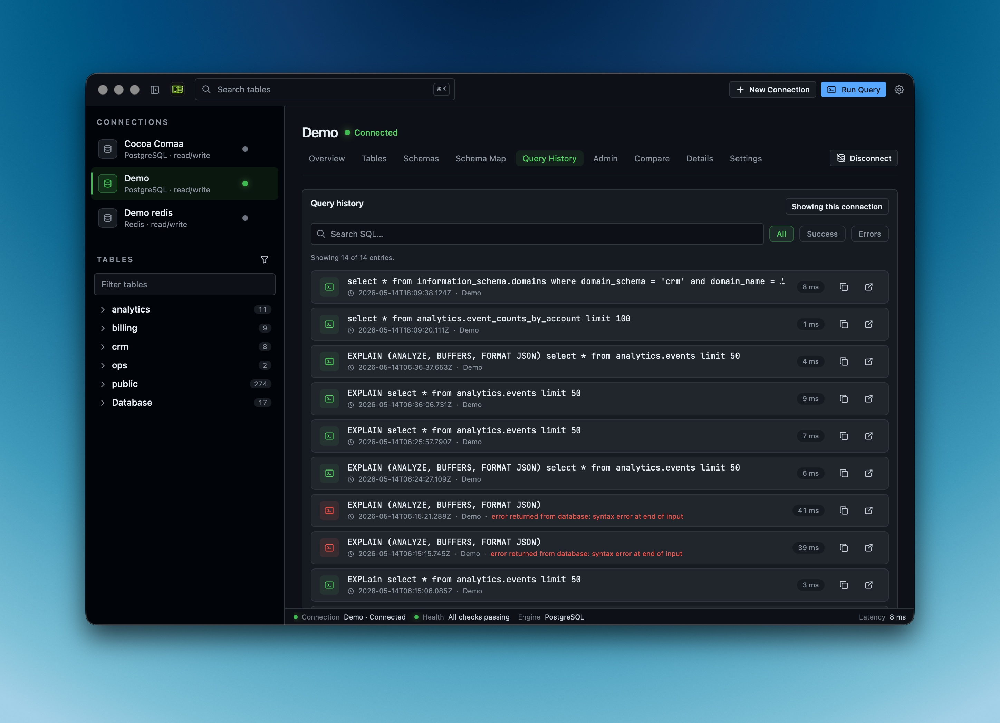
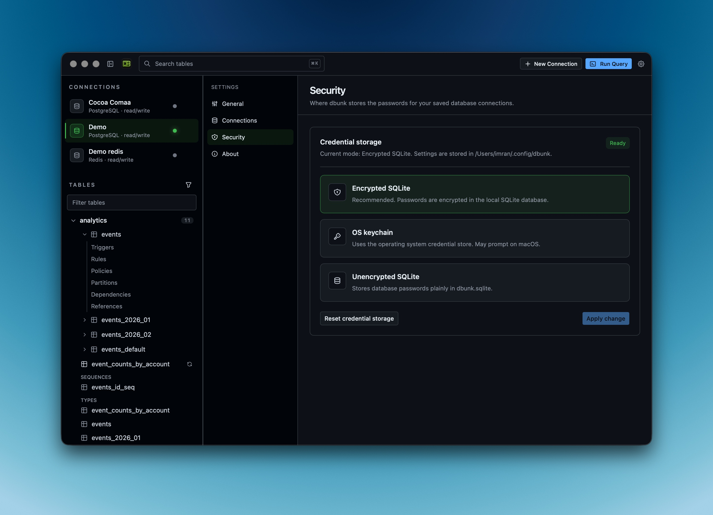

# dbunk

dbunk is an open-source desktop database workspace for exploring data, running SQL, inspecting schema structure, and editing table data from a fast local app.

It is built with Tauri, React, TypeScript, Rust, Monaco Editor, SQLx, and pnpm.



## Status

dbunk is **pre-alpha** and under heavy development. Expect rough edges, missing features, and breaking changes between releases — and please do not point it at production databases yet. Contributions are welcome: bug reports, feature ideas, docs improvements, design polish, database engine support, tests, and small fixes are all useful.

## Install (pre-alpha)

Pre-built binaries for each release are published on the [GitHub Releases page](https://github.com/imran-vz/dbunk/releases).

### macOS (Apple Silicon)

The current pre-alpha only ships an **arm64 DMG**. Intel Macs are not supported.

1. Download the `dbunk_<version>_aarch64.dmg` asset from the latest release.
2. Open the DMG and drag **dbunk** into Applications.
3. The first launch will be blocked by Gatekeeper — the build is unsigned. Use one of:
   - Right-click `dbunk` in Applications → **Open** → confirm in the dialog.
   - Or from a terminal: `xattr -dr com.apple.quarantine /Applications/dbunk.app`
4. Subsequent launches work normally.

Other platforms (Intel macOS, Linux, Windows) are not packaged yet; build from source via the steps below.

## Features

- Manage database connections from a desktop app.
- Browse schemas, tables, and views.
- Run SQL queries with a Monaco-powered editor.
- Use SQL IntelliSense for syntax, tables, views, and columns.
- Execute the current query, a selection, or the whole editor.
- Preview query results in a data grid.
- Inspect table structure, columns, indexes, constraints, and relationships.
- Edit table data where the backend can identify rows safely.
- Export result data.

## Supported Databases

The app currently has support paths for:

- PostgreSQL
- MySQL
- SQLite
- ClickHouse

Some advanced features are engine-specific. PostgreSQL currently has the richest editing and schema-inspection support.

## Screenshots

### SQL Editor

Tabbed editor with syntax highlighting, autocomplete, and one-click formatting.



### EXPLAIN Analysis

Visual query plans that flag overestimates, sequential scans, and planning overhead.



### Data Grid

Browse, filter, sort, and edit rows with virtualised tables and inline schema info.



### FK Drill-Down

Follow foreign keys inline as a mini-table under the clicked row — never lose your place.



### Schema Maps

Visual relationship diagrams that reveal your database structure.



### Redis Workspace

First-class Redis: strings, hashes, lists, sets, streams, pub/sub, and a built-in CLI.



### Query History

Every query you've run — searchable, scoped by connection, and replayable in one click.



### Encrypted Credentials

Passwords encrypted in a local SQLite vault, or stored in the OS keychain — your call.



## Getting Started

### Requirements

- [Rust](https://www.rust-lang.org/tools/install)
- System dependencies required by [Tauri](https://tauri.app/start/prerequisites/)

### Install

```bash
pnpm install
```

### Run The App

```bash
pnpm run dev
```

### Run The Web UI Only

```bash
pnpm run dev:vite
```

### Test And Check

```bash
pnpm run test
pnpx tsc --noEmit
pnpm run lint
```

### Build

```bash
pnpm run build
```

## Project Structure

- `src/` - React app, UI components, client store, SQL helpers, tests.
- `src-tauri/` - Tauri app shell and Rust backend commands.
- `docs/` - project and agent-facing documentation.

## Contributing

Contributions are welcome. Please read [CONTRIBUTING.md](CONTRIBUTING.md) before opening a pull request.

Good first contributions include:

- Reproducing and filing bugs.
- Improving README/docs.
- Adding focused tests for SQL editor behavior.
- Fixing UI polish issues.
- Improving database-specific schema support.
- Making error messages clearer.

## Security

Please do not open public issues for security vulnerabilities. See [SECURITY.md](SECURITY.md).

## License

dbunk is released under the [MIT License](LICENSE).
