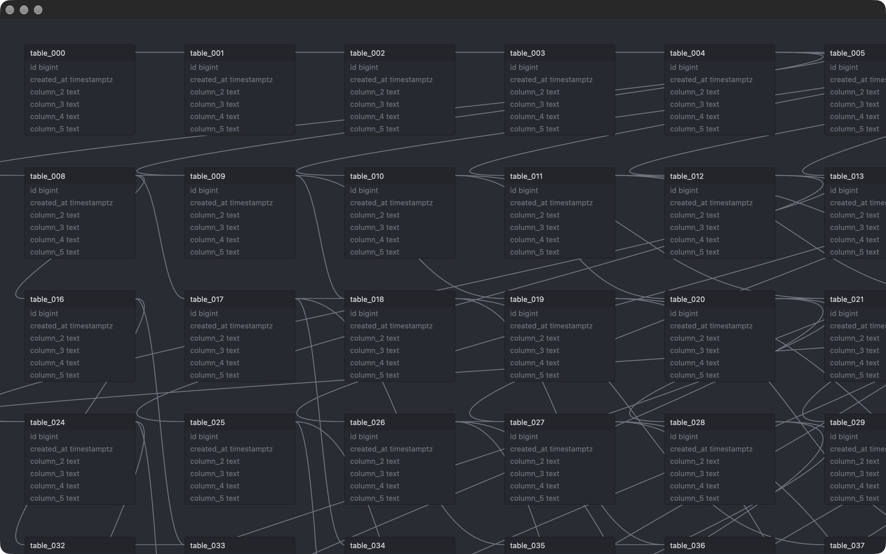
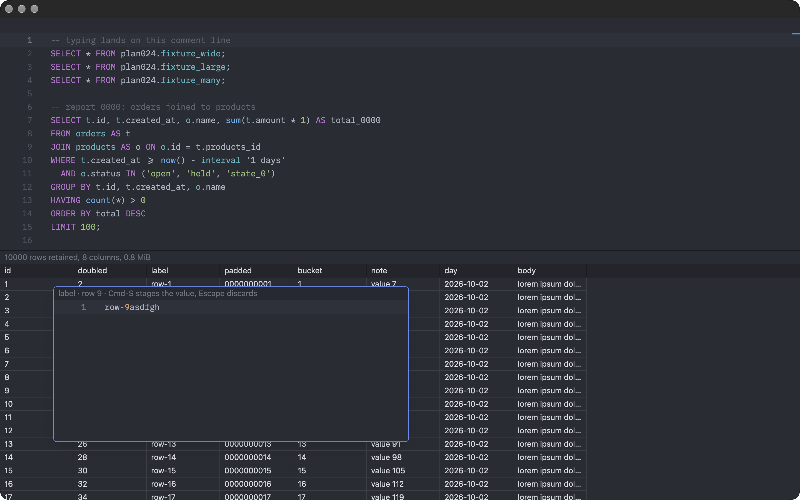
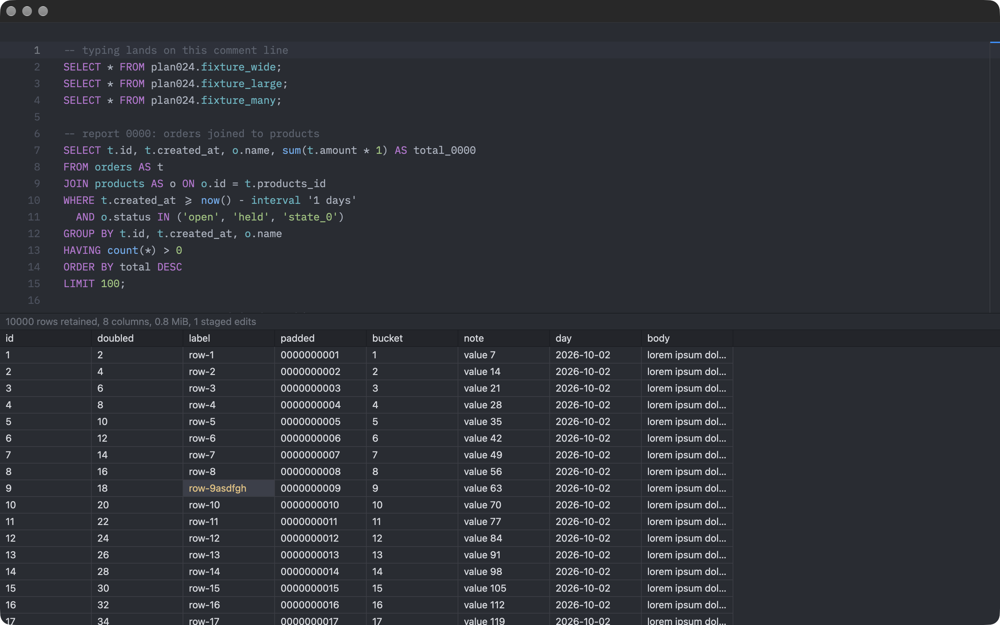

# Plan 024 Step 5: probes for parts with no ready-made component

Run on 2026-10-02 with the spike in `spikes/gpui-path-z`. The accessibility
probe has its own file, `accessibility-probe.md`.

## Schema map

`DBUNK_SPIKE_MAP=<tables>` opens `src/schema_map.rs` alone: table nodes as
ordinary elements placed in screen space, relationship edges as stroked
Bezier paths on a canvas under them, pan by scrolling or dragging the
background, zoom about the pointer with Cmd-scroll, drag a node to move it.
Only nodes that intersect the viewport become elements. About 240 lines.

The largest fixture schema has 27 objects. The probe used 60 and 300 tables.

| Tables | Frames per second while panning | Frame interval p95 | Long frames | Footprint before, during, 6 s after |
| ---: | ---: | ---: | ---: | --- |
| 60 | 109 | 10.1 ms | 3.3% | 277 MiB during |
| 300 | 112 | 10.0 ms | 0.5% | 138, about 630, 347 MiB |

- **Works**: pan, drag, node culling, edges. Frame pacing holds at 300
  tables.
- **Not exercised by the harness**: zoom (it cannot post a modified scroll)
  and node dragging. Both are implemented and were not checked.
- **Gap, costed**: GPUI has no element transform, so zoom multiplies every
  length and the font size by hand. That is a few lines per element here; it
  rules out reusing ordinary components inside a zoomed canvas unchanged.
- **Cost to design around**: panning 300 tables raised the footprint from
  138 MiB to about 630 MiB. It stopped there across three more passes and
  fell to 347 MiB six seconds after the last event, so it is a cache, not a
  leak. The likely source is path rasterization for edges that span the
  window. A real map should cull edges and simplify the ones it keeps.
- **Not built**: automatic layout, saved positions, edge routing around
  nodes, the minimap, and selection. React Flow supplies layout hooks and
  routing today.

## Specialized cell editor

Double-clicking a grid cell opens a multi-line Zed editor over it with JSON
highlighting (ADR-0014's JSON editor is the model). Cmd-S stages the text as
a pending edit; Escape discards it. The staged value is drawn in place of the
stored one in the theme's "modified" color, and the status line counts staged
edits. Nothing is written to the result model. About 90 lines in
`src/grid.rs`.

- **Works**: open on double click, edit, stage, discard, redraw.
- **Found on the way**: focus is manual. The grid's own focus tracking runs
  after a cell's mouse listener and took the focus back from the editor until
  the cell listener stopped propagation. The browser does this routing for
  the React grid.
- **Not built**: positioning the editor at the cell, type-specific editors
  (date, enum, boolean, array), validation, and the hand-off to the staged
  mutation review.

## Editor behaviors

| Behavior | Result |
| --- | --- |
| SQL highlighting | Works, from a Tree-sitter grammar compiled in. |
| Completion from an application-supplied list | Works through `CompletionProvider`; suppressed inside line comments. Not exercised by the harness. |
| Run the statement under the caret | Works (Cmd-Enter), by splitting on semicolons. dbunk's statement splitter has to be ported; it handles strings, comments and dollar quotes. |
| Typing, caret movement by keyboard | Works, measured. |
| Undo and redo, find, multi-cursor, clipboard | Zed editor features; not exercised here. Find is a `search` crate view bound to Zed's workspace toolbar and has not been embedded. |
| IME composition | Not exercised. Needs a person with an input method. |
| SQL formatting | Absent. The React app uses a JavaScript formatter; the native app needs a Rust one. |
| Diagnostics with Unicode offsets | Absent. Zed's diagnostics come from a language server; dbunk would set them from the server's error position. |

## Grid behaviors

| Behavior | Result |
| --- | --- |
| Row virtualization | Works, through `uniform_list`. |
| Column virtualization | Works, application code: each row draws only the columns in view. |
| Batched stream with retention limits | Works: one repaint per 200-row batch, 10,000 rows per result, 32 MiB per execution. |
| Stale-execution rejection | Works: a batch from an earlier execution is dropped. |
| Cell and range selection, tab-separated copy | Implemented; a single click was not exercised by the harness. |
| Column resize | Implemented; not exercised by the harness. |
| Large cells | Works. A cell is drawn from its first 256 characters; the full value stays for copy and for an inspector. |
| Header follows horizontal scroll | Works, one frame behind the body: the header reads the scroll offset from the previous frame. Visible as a slight lag; fixing it means sharing one scroll container. |
| Scrollbars | Absent. Wheel only. `ui::Scrollbar` exists. |
| Accessibility | Works as a table after roles were added. See `accessibility-probe.md`. |
